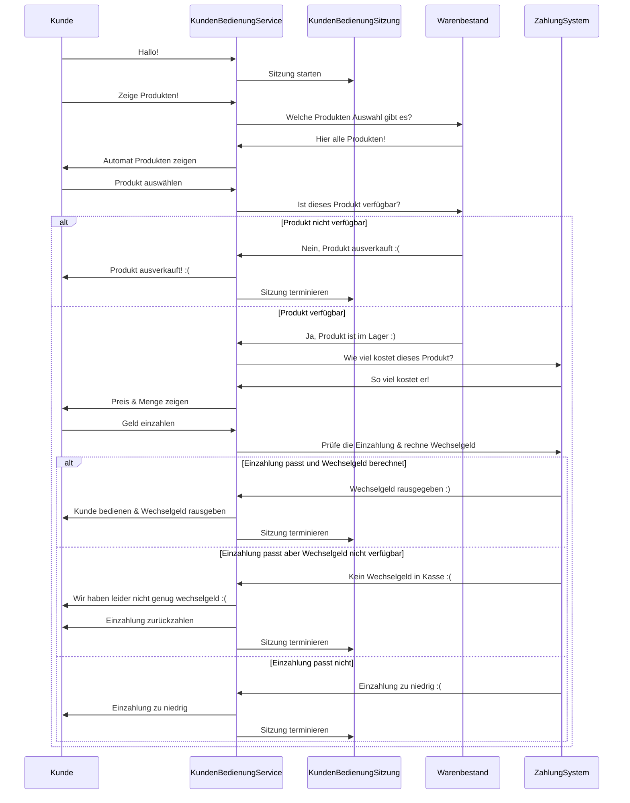

# KundenBedienung Sequenz Diagram

Änderungen in Business Logik sollen zuerst hier auftauchen, danach implementiert werden.

## Prozess Workflow

```mermaid
  sequenceDiagram
    Kunde->>KundenBedienungService: Hallo!
    KundenBedienungService->>KundenBedienungSitzung: Sitzung starten
    Kunde->>KundenBedienungService: Zeige Produkten!
    KundenBedienungService->>Warenbestand: Welche Produkten Auswahl gibt es?
    Warenbestand->>KundenBedienungService: Hier alle Produkten!
    KundenBedienungService->>Kunde: Automat Produkten zeigen
    Kunde->>KundenBedienungService: Produkt auswählen
    KundenBedienungService->>Warenbestand: Ist dieses Produkt verfügbar?
    alt Produkt nicht verfügbar
    Warenbestand->>KundenBedienungService: Nein, Produkt ausverkauft :(
    KundenBedienungService->>Kunde: Produkt ausverkauft! :(
    KundenBedienungService->>KundenBedienungSitzung: Sitzung terminieren
    else Produkt verfügbar
    Warenbestand->>KundenBedienungService: Ja, Produkt ist im Lager :)
    KundenBedienungService->>ZahlungSystem: Wie viel kostet dieses Produkt?
    ZahlungSystem->>KundenBedienungService: So viel kostet er!
    KundenBedienungService->>Kunde: Preis & Menge zeigen
    Kunde->>KundenBedienungService: Geld einzahlen
    KundenBedienungService->>ZahlungSystem: Prüfe die Einzahlung & rechne Wechselgeld
    alt Einzahlung passt und Wechselgeld berechnet
    ZahlungSystem->>KundenBedienungService: Wechselgeld rausgegeben :)
    KundenBedienungService->>Kunde: Kunde bedienen & Wechselgeld rausgeben
    KundenBedienungService->>KundenBedienungSitzung: Sitzung terminieren
    else Einzahlung passt aber Wechselgeld nicht verfügbar
    ZahlungSystem->>KundenBedienungService: Kein Wechselgeld in Kasse :(
    KundenBedienungService->>Kunde: Wir haben leider nicht genug wechselgeld :(
    KundenBedienungService->>Kunde: Einzahlung zurückzahlen
    KundenBedienungService->>KundenBedienungSitzung: Sitzung terminieren
    else Einzahlung passt nicht 
    ZahlungSystem->>KundenBedienungService: Einzahlung zu niedrig :(
    KundenBedienungService->>Kunde: Einzahlung zu niedrig
    KundenBedienungService->>KundenBedienungSitzung: Sitzung terminieren
    end
    end
```